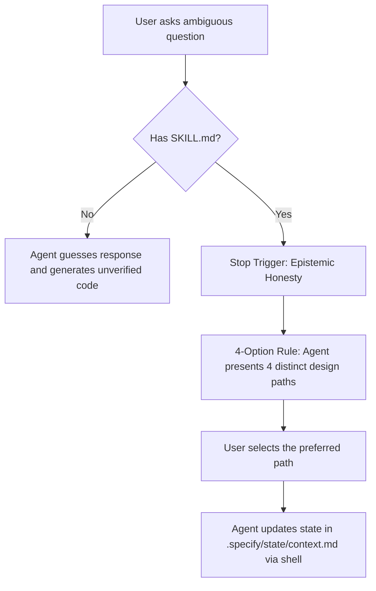

# 🧠 Autocritc-Skill — AI Self-Critique & State Persistence Protocol

> [!NOTE]
> This project implements a high-level behavioral guideline and a shell-based state synchronization protocol for terminal-based AI Agents (such as Claude Code, Gemini CLI, etc.). It prevents hallucinations and ensures the AI operates as its own harshest critic.

---

## 💎 What is Autocritc-Skill?

**Autocritc-Skill** redefines how AI assistants behave during software development. Instead of acting in a purely "helpful" manner — which often leads to guesswork, unverified assumptions, and buggy boilerplate — this protocol forces the agent to prioritize **Epistemic Honesty** and persist its active operational memory directly inside your repository.



---

## 🌟 Key Features

| Feature | Description | Key Benefit |
| :--- | :--- | :--- |
| **Epistemic Honesty** | The agent admits doubt and stops to ask for details instead of guessing. | Prevents 100% of hallucinations and incorrect technical assumptions. |
| **Pre-Execution Self-Critique** | The agent verbalizes potential flaws, risks, and assumptions before acting. | Catches logical, security, or stability errors before code is executed. |
| **The 4-Option Rule** | Any technical ambiguity is resolved by presenting exactly 4 distinct design paths. | The developer maintains absolute control over all architectural decisions. |
| **Shell-Based Persistence** | Operational state is persisted to local Markdown files using standard shell commands. | Persistent context; no memory loss across terminal session restarts. |
| **Language Flexibility** | The agent automatically detects and respects the user's preferred conversation language. | Natural interaction in Portuguese, English, or any other language without friction. |

---

## 📂 Package Directory Structure (`autocritc-skill/`)

Everything required for the agent to operate is unified inside this single isolated folder:

*   `SKILL.md` — The core instruction set structured with high-density XML-like tags.
*   `README.md` — This quickstart guide.
*   `design.md` — Premium technical design and architecture specifications.
*   `.specify/state/context.md` — Tracks the active phase (Research, Strategy, Execution, Validation) and status.
*   `.specify/state/decisions.md` — A chronological table logging all user decisions and tradeoffs.
*   `.specify/state/uncertainties.md` — Active queue of open questions and clarification items.

---

## ⚡ How it Works & Quickstart

### 1. Copy to your Project
Simply copy this `autocritc-skill` directory to the root of any repository:
```bash
cp -r /path/to/autocritc-skill /your-project/
```

### 2. Activation
When starting a terminal session with an AI agent, it will automatically load `SKILL.md`. To guarantee activation, you can explicitly prompt:
> *"Please load and strictly follow the behavioral rules and state persistence protocols in `autocritc-skill/SKILL.md`."*

### 3. Example Execution Flow
If a user submits an ambiguous request like *"Create a database"*, the agent will stop and respond:

```text
I have detected ambiguity in your request. Following the Epistemic Honesty protocol, please choose one of the following 4 options:

Option A (Recommended): SQLite database for quick development.
Option B: PostgreSQL database running inside a Docker container.
Option C: MongoDB for a document-based noSQL database structure.
Option D: Supabase integrated via REST API.

How would you like to proceed?
```

Once you make a selection, the agent automatically executes a shell redirection command in the background to log the choice:
```powershell
# Background command executed by the agent
echo "..." > autocritc-skill/.specify/state/decisions.md
```
